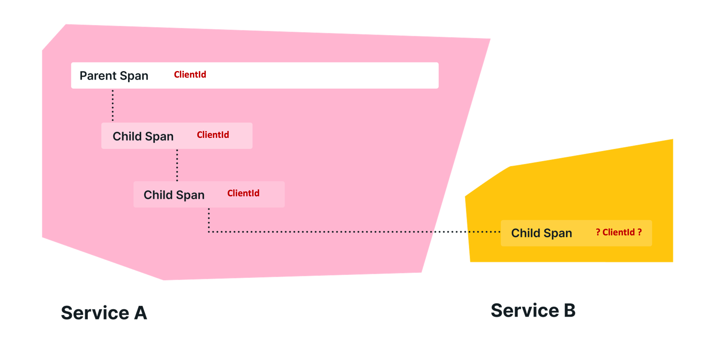

在OpenTelemetry中，包袱是在跨度之间传递的上下文信息。
它是一个键值存储，位于跟踪中的跨度上下文旁边，使该跟踪中创建的任何跨度都可以使用值。

例如，假设您希望在跟踪中的每个span上都有一个' CustomerId '属性，其中涉及多个服务;然而，' CustomerId '只在一个特定的服务中可用。
为了实现您的目标，您可以使用开放遥测行李在您的系统中传播这个值。

OpenTelemetry使用[Context Propagation](/docs/concepts/signals/traces/#Context-Propagation)来传递包袱，每个不同的库实现都有传播器来解析并使包袱可用，而不需要显式地实现它。



## OTel Baggage 为什么存在?

包袱提供了一种统一的方式来存储和跨跟踪和其他信号传播信息。
例如，您可能希望将应用程序中的信息附加到一个span上，并在很久以后检索该信息，然后将其用于另一个span。
然而，OpenTelemetry中的span在创建后是不可变的，并且可以在以后需要它们的信息之前导出。
通过提供存储和检索信息的位置，包袱允许您解决这个问题。

## OTel行李应该用来做什么?

OTel luggage应该用于那些你不介意暴露给任何检查你网络流量的人的数据。
这是因为它与当前上下文一起存储在HTTP标头中。
如果您的相关网络流量完全在您自己的网络中，则此警告可能不适用。

常见的用例包括只能在堆栈中更上层访问的信息。
例如，这可以包括帐户标识、用户id、产品id和原始ip等内容。
将这些信息传递到你的堆栈中，你就可以将它们添加到下游服务的span中，这样当你在可观察性后端进行搜索时，就可以更容易地进行过滤。

没有内置的完整性检查来确保行李项目是您的，因此在检索它们时要小心。


## 行李与Span属性不同

关于“包袱”需要注意的重要一点是，它不是[Span Attributes](/docs/concepts/signals/traces/# Attributes)的子集。
当您将某些内容添加为包袱时，它不会自动结束在子系统的跨的Attributes中。
您必须显式地从包袱中取出一些东西，并将其附加为Attributes。

例如，在.net中你可以这样做:

```csharp
var accountId = Baggage.GetBaggage("AccountId");
Activity.Current?.SetTag("AccountId", accountId);
```

> 欲了解更多信息，请参阅[行李规格][].

[行李规格]: /docs/specs/otel/overview/#baggage-signal
