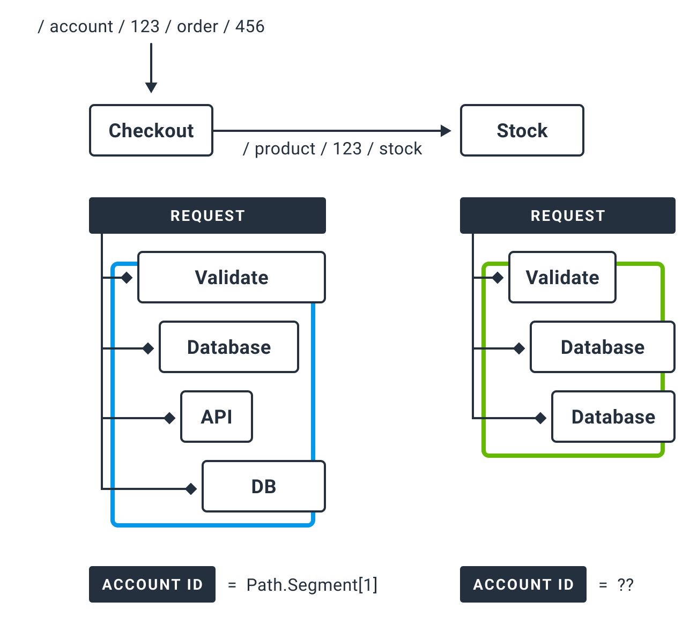

在 OpenTelemetry 中，Baggage 是在 spans 之间传递的上下文信息。它是一个键值存储，
位于跟踪中的 span 上下文旁边，使该跟踪中创建的任何 span 都可以使用值。

例如，假设您希望在跟踪中的每个 span 上都有一个 `CustomerId` 属性，其中涉及多个服
务;然而，`CustomerId` 只在一个特定的服务中可用。为了实现您的目标，您可以使用开放
遥测 Baggage 在您的系统中传播这个值。

OpenTelemetry 使用[Context Propagation]来传递 Baggage，每个不同的库实现都有传播
器来解析并使 Baggage 可用，而不需要显式地实现它。


[Context Propagation]: ./traces.md#Context-Propagation

## Baggage 为什么存在?

Baggage 提供了一种统一的方式来存储和跨跟踪和其他信号传播信息。例如，您可能希望将
应用程序中的信息附加到一个 span 上，并在很久以后检索该信息，然后将其用于另一个
span。然而，OpenTelemetry 中的 span 在创建后是不可变的，并且可以在以后需要它们的
信息之前导出。通过提供存储和检索信息的位置，Baggage 允许您解决这个问题。

## Baggage 应该用来做什么?

OTel Baggage 应该用于那些你不介意暴露给任何检查你网络流量的人的数据。这是因为它
与当前上下文一起存储在 HTTP 标头中。如果您的相关网络流量完全在您自己的网络中，则
此警告可能不适用。

常见的用例包括只能在堆栈中更上层访问的信息。例如，这可以包括帐户标识、用户 id、
产品 id 和原始 ip 等内容。将这些信息传递到你的堆栈中，你就可以将它们添加到下游服
务的 span 中，这样当你在可观察性后端进行搜索时，就可以更容易地进行过滤。

没有内置的完整性检查来确保 Baggage 项目是您的，因此在检索它们时要小心。



## Baggage 与 Span 属性不同

关于`Baggage`需要注意的重要一点是，它不是[Span Attributes]的子集。当您将某些内容
添加为 Baggage 时，它不会自动结束在子系统的跨的 Attributes 中。您必须显式地从
Baggage 中取出一些东西，并将其附加为 Attributes。

[Span Attributes]: ./traces.md#Attributes

例如，在.net 中你可以这样做:

```csharp
var accountId = Baggage.GetBaggage("AccountId");
Activity.Current?.SetTag("AccountId", accountId);
```

> 欲了解更多信息，请参
> 阅[Baggage 规格](../../specs/otel/overview.md#baggage-signal).
