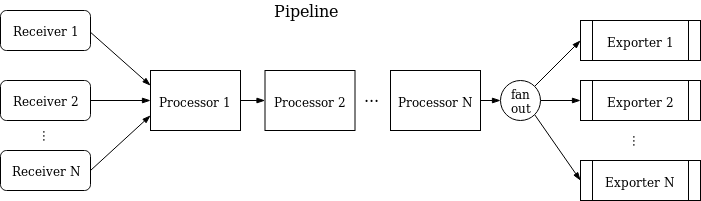
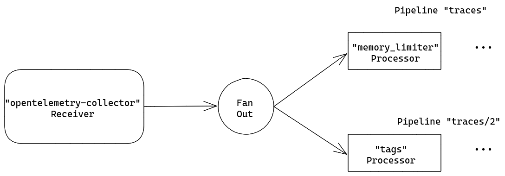
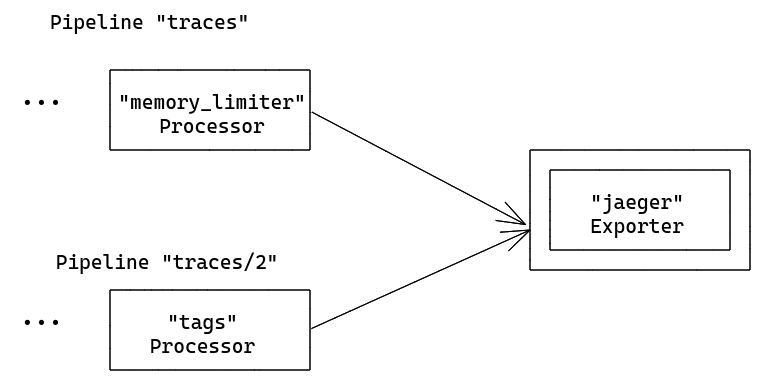
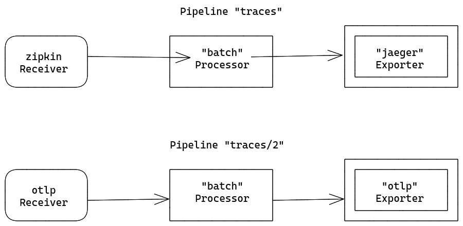
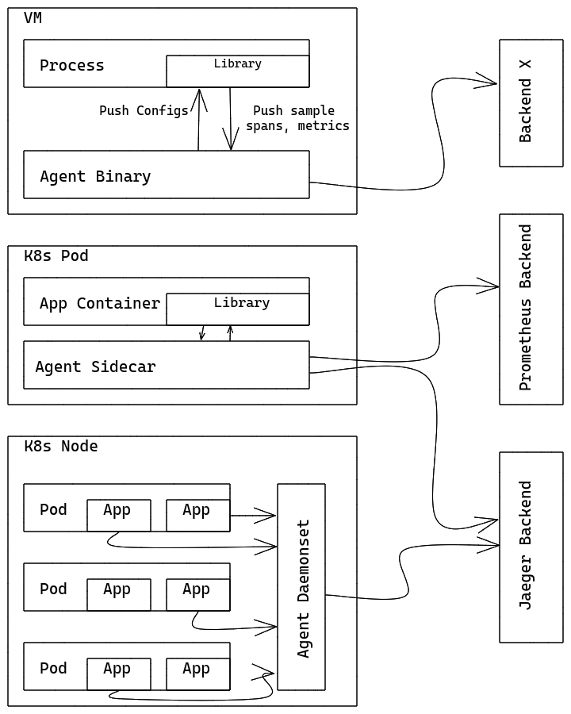

# 收集器架构

本文档描述了 OpenTelemetry Collector 的架构设计和实现。

## 总结

OpenTelemetry Collector 是一个可执行程序，它可以接收遥测数据，可选地处理它，并进
一步导出它。

Collector 支持几个流行的开源协议来接收和发送遥测数据，并提供一个可插入的架构来添
加更多的协议。

数据接收、处理和导出使用[Pipelines](#pipelines)完成。可以将 Collector 配置为具有
一个或多个管道。每个管道包括:

- 接收数据的一组[接收器](#receiver)
- 一系列可选的[处理器](#processors)，它们从接收端获取数据并进行处理
- 一组[导出器](#exports)从处理器获取数据并将其发送到收集器之外。

同一个接收器可以包含在多个管道中，多个管道可以包含同一个导出器。

## 管道

管道定义了数据在收集器中遵循的路径，从接收器开始，然后进一步处理或修改，最后通过
导出器退出收集器。

管道可以在 3 种遥测数据类型上运行:轨迹、度量和日志。数据类型是由其配置定义的管道
的属性。管道中使用的接收器、处理器和导出器必须支持特定的数据类型，否则在加载配置
时将报告`ErrDataTypeIsNotSupported`。管道可以用下面的方式来描述:



管道中可以有一个或多个接收器。来自所有接收器的数据被推送到第一个处理器，该处理器
对其执行处理，然后将其推送到下一个处理器(或者它可能丢弃数据，例如，如果它是一个“
采样”处理器)，等等，直到管道中的最后一个处理器将数据推送到导出器。每个导出器获得
每个数据元素的副本。最后一个处理器使用`fanoutconsumer`将数据分散到多个导出器。

管道是在 Collector 启动期间根据配置中的管道定义构建的。

管道配置通常是这样的:

```yaml
service:
  pipelines: # section that can contain multiple subsections, one per pipeline
    traces: # type of the pipeline
      receivers: [otlp, jaeger, zipkin]
      processors: [memory_limiter, batch]
      exporters: [otlp, jaeger, zipkin]
```

上面的例子为“跟踪”类型的遥测数据定义了一个管道，有 3 个接收器，2 个处理器和 3 个
输出器。

有关配置文件格式的详细信息，请参
阅[本文档](https://docs.google.com/document/d/1NeheFG7DmcUYo_h2vLtNRlia9x5wOJMlV4QKEK05FhQ/edit#).

### 接收器 - Receivers

接收器通常监听网络端口并接收遥测数据。通常将一个接收器配置为将接收到的数据发送到
一个管道，但是也可以将同一个接收器配置为将接收到的相同数据发送到多个管道。这可以
通过简单地在几个管道的 `receiver` 键中列出相同的接收器来实现:

```yaml
receivers:
  otlp:
    protocols:
      grpc:
        endpoint: localhost:4317

service:
  pipelines:
    traces: # a pipeline of “traces” type
      receivers: [otlp]
      processors: [memory_limiter, batch]
      exporters: [jaeger]
    traces/2: # another pipeline of “traces” type
      receivers: [otlp]
      processors: [batch]
      exporters: [opencensus]
```

在上面的例子中，`otlp`接收器将发送相同的数据到管道`traces`和管道`traces/2`。 (注
意:配置使用复合键名的形式为`type[/name]`，定义
见[本文档](https://docs.google.com/document/d/1NeheFG7DmcUYo_h2vLtNRlia9x5wOJMlV4QKEK05FhQ/edit#)).

当 Collector 加载此配置时，结果将如下所示(为简洁起见，图中省略了部分处理器和导出
器):



!!! import "重要提示"

    当同一个接收器在多个管道中被引用时，收集器将在运行时仅创建一个接收器实例，该实例将数据发送给扇出消费者，后者将数据发送给每个管道的第一个处理器。
    数据从接收器到扇形消费者，再到处理器的传播是通过同步函数调用完成的。
    这意味着，如果一个处理器阻塞了调用，则附加到此接收器的其他管道将被阻止接收相同的数据，并且接收器本身将停止处理和转发新接收到的数据。

### 导出器 - Exporters

导出器通常将数据转发到网络上的一个目的地(但他们也可以将其发送到其他地方，例
如`logging`导出器将遥测数据写入日志目的地)。

该配置允许拥有相同类型的多个导出器，甚至在同一管道中也是如此。例如，可以定义 2
个`otlp`导出器，每个导出器发送到不同的 OTLP 端点，例如:

```yaml
exporters:
  otlp/1:
    endpoint: example.com:4317
  otlp/2:
    endpoint: localhost:14317
```

通常一个导出器从一个管道获取数据，但是也可以配置多个管道向同一个导出器发送数据，
例如:

```yaml
exporters:
  jaeger:
    protocols:
      grpc:
        endpoint: localhost:14250

service:
  pipelines:
    traces: # a pipeline of “traces” type
      receivers: [zipkin]
      processors: [memory_limiter]
      exporters: [jaeger]
    traces/2: # another pipeline of “traces” type
      receivers: [otlp]
      processors: [batch]
      exporters: [jaeger]
```

在上面的例子中，`jaeger`导出器将从管道`traces`和管道`traces/2`中获取数据。当
Collector 加载此配置时，结果将如下所示(为简洁起见，图中省略了部分处理器和接收器
):



### 处理器 - Processors

管道可以包含顺序连接的处理器。第一个处理器从为管道配置的一个或多个接收器获取数据
，最后一个处理器将数据发送到为管道配置的一个或多个导出器。第一处理器和最后处理器
之间的所有处理器严格地仅从前面的一个处理器接收数据，并严格地仅向后面的处理器发送
数据。

处理器可以在转发数据之前对其进行转换(即在跨度中添加或删除属性)，它们可以通过决定
不转发数据来删除数据(例如，`probabilisticsampler`处理器就是这样工作的)，它们也可
以生成新数据。这就是`spanmetrics`处理器为管道处理的跨度生成指标的方式。

处理器的相同名称可以在多个管道的`processors`键中引用。在这种情况下，每个处理器将
使用相同的配置，但是每个管道将始终获得自己的处理器实例。每个处理器都有自己的状态
，这些处理器永远不会在管道之间共享。例如，如果在多个管道中使用“批处理”处理器，每
个管道将有自己的批处理处理器(尽管如果每个批处理处理器在配置中引用相同的键，则它
们将以完全相同的方式配置)。以如下配置为例:

```yaml
processors:
  batch:
    send_batch_size: 10000
    timeout: 10s

service:
  pipelines:
    traces: # a pipeline of “traces” type
      receivers: [zipkin]
      processors: [batch]
      exporters: [jaeger]
    traces/2: # another pipeline of “traces” type
      receivers: [otlp]
      processors: [batch]
      exporters: [otlp]
```

当 Collector 加载此配置时，结果将如下所示:



请注意，每个`batch`处理器都是一个独立的实例，尽管两者都以相同的方式配置，即每个
都有一个 10000 的`send_batch_size`。

同一个处理器的名字不能在一个管道的`processors`键中被多次引用。

<a name="opentelemetry-agent"></a>

## 作为代理运行

在典型的 VM/容器上，有一些用户应用程序运行在一些带有 OpenTelemetry Library
(Library)的进程/pod 中。以前，Library 对跟踪/指标/日志进行所有的记录、收集、采样
和聚合，并通过 Library 导出器将它们导出到其他持久存储后端，或者在本地页面上显示
它们。这种模式有几个缺点，例如:

1. 对于每个 OpenTelemetry Library，出口商/zpages 需要用本地语言重新实现。
2. 在某些编程语言(如 Ruby、PHP)中，很难在进程中进行统计聚合。
3. 要启用导出 OpenTelemetry span /stats/metrics，应用程序用户需要手动添加库导出
   器并重新部署它们的二进制文件。当已经发生了事件，并且用户想要使用
   OpenTelemetry 立即调查发生了什么事情时，这一点尤其困难。
4. 应用程序用户需要负责配置和初始化导出程序。这是容易出错的(例如，他们可能没有设
   置正确的凭据/被监视的资源)，并且用户可能不愿意用 OpenTelemetry“污染”他们的代
   码。

要解决上述问题，您可以将 OpenTelemetry Collector 作为代理运行。 Agent 作为虚拟机
/容器中的守护进程运行，可以独立于 Library 进行部署。一旦 Agent 部署并运行，它应
该能够从 Library 检索跟踪/指标/日志，并将它们导出到其他后端。我们也可以给 Agent
推送配置(例如采样概率)到库的能力。对于那些不能在过程中进行统计聚合的语言，它们也
应该能够发送原始度量并让 Agent 进行聚合。



对于其他库的开发人员/维护者: Agent 还可以接受来自其他跟踪/监控库的跟踪/指标/日志
，如 Zipkin,Prometheus 等。这是通过添加特定的接收器来实现的。详情请参
见[receiver](#receiver)。

<a name="opentelemetry-collector"></a>

## 作为网关运行

OpenTelemetry Collector 可以作为 Gateway 实例运行，并接收由一个或多个代理或库导
出的跨度和指标，或者由在受支持的协议之一中发出的任务/代理导出的跨度和指标。收集
器被配置为将数据发送到已配置的导出器。下图总结了部署架构:


OpenTelemetry Collector 还可以部署在其他配置中，例如以其接收器支持的格式之一从其
他代理或客户端接收数据。
